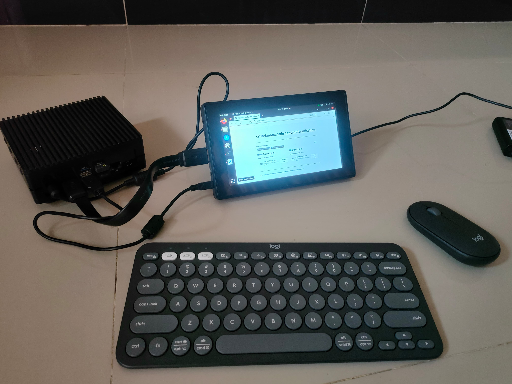

# Edge AI-Based Melanoma Classifier Through CLAHE Enhancement and Deep Learning

Panca Wiguna Sitanggang, Kahlil Muchtar, Safrizal Razali, Fardian Fardian, Aulia Rahman, Novi Maulina  

  

 

> **Abstract:** _Skin cancer, particularly melanoma, is one of the most dangerous types of cancer and requires early detection for effective treatment. This study presents the development and evaluation of a skin disease classification system based on deep learning using VGG-19 and ResNet-50 architectures. CLAHE is used as a preprocessing method to enhance image quality, which significantly improves model performance. Evaluation results show that after applying CLAHE, both VGG-19 and ResNet-50 achieved up to 100% in accuracy, recall, and F1-score, while precision and specificity increased to 100% and 99%, respectively. These results demonstrate the robustness of CLAHE-enhanced input in improving classification effectiveness. The best-performing models were deployed on the NVIDIA Jetson Orin Nano for real-time inference. The system is integrated with a Streamlit-based web interface that allows users to upload skin images and receive classification results instantly, displaying the predicted disease class along with confidence scores. This research demonstrates the effectiveness of integrating image enhancement techniques, deep learning, and Edge AI to support practical and efficient early melanoma detection._
