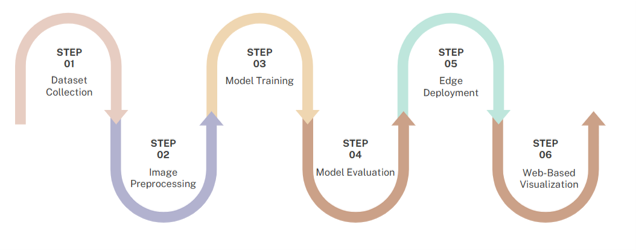
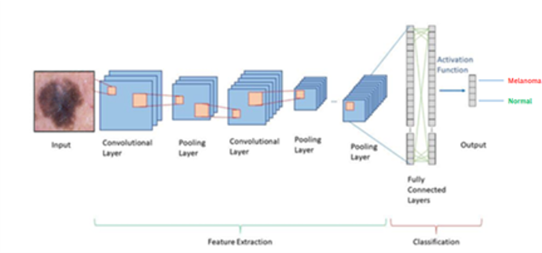
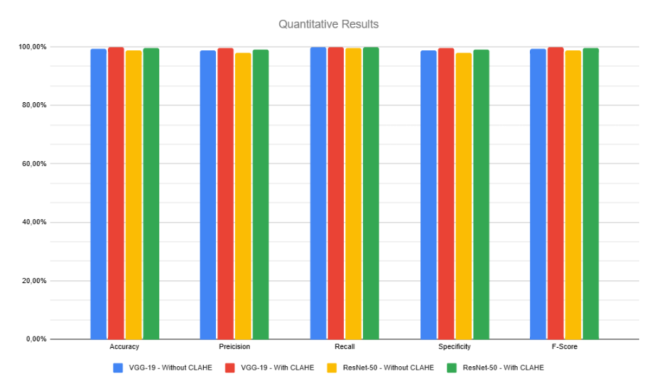
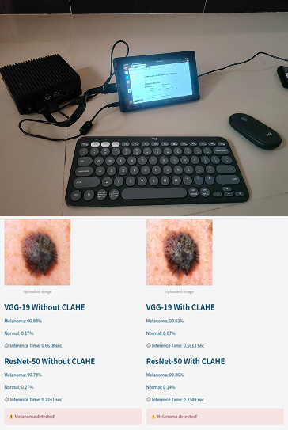

<div align="center">

[](https://ieeexplore.ieee.org/document/11211091)

# Edge AI-Based Melanoma Classifier Through CLAHE Enhancement and Deep Learning

Panca Wiguna Sitanggang (Universitas Syiah Kuala), [Kahlil Muchtar (Universitas Syiah Kuala, COMVISLAB USK)](https://comvis.mystrikingly.com/), Safrizal Razali (Universitas Syiah Kuala), Fardian (Universitas Syiah Kuala), Aulia Rahman (Universitas Syiah Kula), and Novi Maulina (Universitas Syiah Kuala)

</div>

---

<div align="justify">

> **Abstract:** _Skin cancer, particularly melanoma, is one of the most dangerous types of cancer and requires early detection for effective treatment. This study presents the development and evaluation of a skin disease classification system based on deep learning using VGG-19 and ResNet-50 architectures. CLAHE is used as a preprocessing method to enhance image quality, which significantly improves model performance. Evaluation results show that after applying CLAHE, both VGG-19 and ResNet-50 achieved up to 100% in accuracy, recall, and F1-score, while precision and specificity increased to 100% and 99%, respectively. These results demonstrate the robustness of CLAHE-enhanced input in improving classification effectiveness. The best-performing models were deployed on the NVIDIA Jetson Orin Nano for real-time inference. The system is integrated with a Streamlit-based web interface that allows users to upload skin images and receive classification results instantly, displaying the predicted disease class along with confidence scores. This research demonstrates the effectiveness of integrating image enhancement techniques, deep learning, and Edge AI to support practical and efficient early melanoma detection._

</div><br>

<p align="center">
  
</p>

<small>_Fig. 1. The overall system pipeline, including dataset collection, CLAHE based enhancement, CNN model training, Jetson deployment, and Streamlit visualization._</small>
<br><br>

<p align="center">
  
</p>

<small>_Fig. 2. CNN architecture used in this study, consisting of convolutional layers, pooling layers, fully connected layers, and final softmax output for classifying melanoma and normal skin images. [16]._</small>

---

## 📊 Data

Please download the ISIC and USK-Normal Skin datasets, available as original images and CLAHE-enhanced images. Both datasets include predefined training, validation, and test splits.

- **Original Dataset:**  
  [🔗 Google Drive Link](https://drive.google.com/drive/folders/1NahEkY_dJYhWXGwwSen8ZPiyPwU1OHUi?usp=sharing)

- **CLAHE-Enhanced Dataset:**  
  [🔗 Google Drive Link](https://drive.google.com/drive/folders/16BbVc0NzSQeFAPkaU68oR3GW_I5VAf1W?usp=sharing)

---

## ⚙️ Hyperparameters

<p align="center"><b>Table 1. Hyperparameter Settings For Model Training</b></p>
<div align="center">
  <small>
    <table >
        <tr style="background-color:#b3b3b3; text-align:center;">
            <th>Parameter</th>
            <th>VGG-19</th>
            <th>ResNet-50</th>
        </tr>
        <tr>
            <td>
            Epoch
            </td>
            <td>50</td>
            <td>50</td>
        </tr>
        <tr>
            <td>Batch Size</td>
            <td>2</td>
            <td>2</td>
        </tr>
        <tr>
            <td >Loss Function</td>
            <td>Cross-Entropy</td>
            <td>Cross-Entropy</td>
        </tr>
        <tr>
            <td >Learning Rate</td>
            <td>0.001</td>
            <td>0.001</td>
        </tr>
        </tr>
        <tr>
            <td>Optimizer</td>
            <td>SGD</td>
            <td>SGD</td>
        </tr>
        <tr>
            <td>Momentum</td>
            <td>0.7</td>
            <td>0.7</td>
        </tr>
    </table>
  </small>
</div>

---

## 📦 Pretrained Models

Due to GitHub file size limitations, pretrained models are hosted externally.

Please download the pretrained models and place them in the corresponding
directories before running the application.

- **VGG-19 (Original & CLAHE):**  
  [🔗 Google Drive Link](https://drive.google.com/drive/folders/1hl_t-ZvveDhGEMk26v9hLMXQpSOTl9n8?usp=sharing)

- **ResNet-50 (Original & CLAHE):**  
  [🔗 Google Drive Link](https://drive.google.com/drive/folders/1EjKKeueli2KjesruRsfdnF26Ez-LI9GY?usp=sharing)

---

## 🚀 How to Run

This repository provides a **ready-to-use Streamlit application** for real-time melanoma classification using **pre-trained VGG-19 and ResNet-50 models**, with and without **CLAHE enhancement**.  
**No training is required.**

### 1️⃣ Clone the Repository

```bash
git clone https://github.com/comvislab-usk/EdgeMel.git
cd EdgeMel
```

### 2️⃣ Install Dependencies

```bash
pip install -r requirements.txt
```

<small>If requirements.txt is not available:</small>

```bash
pip install streamlit torch torchvision opencv-python numpy pillow
```

### 3️⃣ Run the Streamlit Application

```bash
streamlit run streamlit/app.py
```

---

## 📈 Results

<p align="center"><b>Table 1. Evaluation Metric Results</b></p>
<div align="center">
  <small>
    <table >
        <tr style="background-color:#b3b3b3; text-align:center;">
            <th>Metric</th>
            <th>VGG19-NoClahe</th>
            <th>VGG19-Clahe</th>
            <th>R50-NoClahe</th>
            <th>R50-Clahe</th>
        </tr>
        <tr style="text-align:center;" >
            <td>
            Accuracy
            </td>
            <td>99%</td>
            <td>100%</td>
            <td>99%</td>
            <td>100%</td>
        </tr>
        <tr style="text-align:center;">
            <td>Precision</td>
            <td>99%</td>
            <td>100%</td>
            <td>98%</td>
            <td>99%</td>
        </tr>
        <tr style="text-align:center;">
            <td >Recall</td>
            <td>99%</td>
            <td>100%</td>
            <td>100%</td>
            <td>100%</td>
        </tr>
        <tr style="text-align:center;">
            <td >Specificity</td>
            <td>99%</td>
            <td>100%</td>
            <td>98%</td>
            <td>99%</td>
        </tr>
        <tr style="text-align:center;">
            <td>F1-Score</td>
            <td>99%</td>
            <td>100%</td>
            <td>99%</td>
            <td>100%</td>
        </tr>
    </table>
  </small>
</div>
<br>

<p align="center">
  
</p>

<small>_Fig. 4. Bar chart comparison of classification metrics(accuracy, precision, recall, specificity, F1-score) for VGG-19 and ResNet-50 with and without CLAHE._</small>

---

## 🎨 Qualitative Results

<p align="center">
  
</p>

<small>_Fig. 5. Streamlit interface deployed on NVIDIA Jetson Orin Nano. The interface allows users to upload skin images and view real-time classification results, including prediction probabilities and inference time._</small>

---

## 📝 Citation

Please consider citing our paper in your publications if the project helps your research.

```
@inproceedings{sitanggang2025edgeai,
  title={Edge AI-Based Melanoma Classifier Through CLAHE Enhancement and Deep Learning},
  author={Panca Wiguna Sitanggang, Kahlil Muchtar,  Safrizal Razali, Fardian, Aulia Rahman, and Novi Maulina },
  booktitle={2025 IEEE International Conference on Networking, Intelligent Systems, and IoT (ICONS-IoT)},
  year={2025},
  doi={10.1109/ICONS-IOT65216.2025.11211091}
}
```
